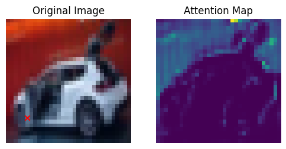

# AlexNet CNN for Image Classification

This project implements the AlexNet Convolutional Neural Network (CNN) in PyTorch to classify images from a dataset of three categories: pizza, steak, and sushi. The project demonstrates how AlexNet can be adapted for small-scale datasets while maintaining its deep learning architecture principles.


## Dataset

The dataset used in this project is structured as follows:


- **Training dataset**: Contains images of three categories: pizza, steak, and sushi.
- **Test dataset**: Contains images of the same categories for evaluating model performance.

## Model Architecture

The project uses a customized AlexNet architecture with the following key components:
1. **Convolutional layers**: Extract spatial features from input images.
2. **ReLU activation**: Adds non-linearity to the model.
3. **MaxPooling layers**: Downsample the feature maps to reduce the spatial dimensions.
4. **Fully connected layers**: Process the flattened feature maps and classify the input into one of the three categories.

### Hyperparameters
- **Learning rate**: `1e-5`
- **Optimizer**: SGD (Stochastic Gradient Descent)
- **Loss function**: Cross-entropy loss (for multi-class classification)

## Data Preprocessing

The images are preprocessed using the following steps:
- Resized to ensure consistent input dimensions.
- Normalized to have a standard mean and variance.
- Augmented with common techniques like flipping and rotations to improve generalization.

## Training

The model is trained using the following approach:
1. **DataLoader**: Loads the images in batches, shuffling the data for better generalization.
2. **Training loop**: For each epoch, the model processes the input images, computes the loss, and updates the model weights using backpropagation.
3. **Evaluation**: The model’s performance is evaluated using accuracy on the test set.

## Attention map produced by cnn


## Accuracy Function

The accuracy function calculates the ratio of correct predictions to the total number of predictions:
```python
def accuracy_fn(y_true, y_pred):
    _, predicted = torch.max(y_pred, 1)
    correct = (predicted == y_true).sum().item()
    accuracy = correct / y_true.shape[0]
    return accuracy
### Results
After training, the model achieves a certain level of accuracy on the test set, demonstrating its capability to classify images into pizza, steak, and sushi categories. Future work may include fine-tuning hyperparameters or experimenting with different architectures for improved results.

Future Improvements
Experiment with different optimizers (e.g., Adam) for better convergence.
Add more image categories to increase the complexity of the task.
Implement data augmentation techniques to improve generalization on unseen data.
